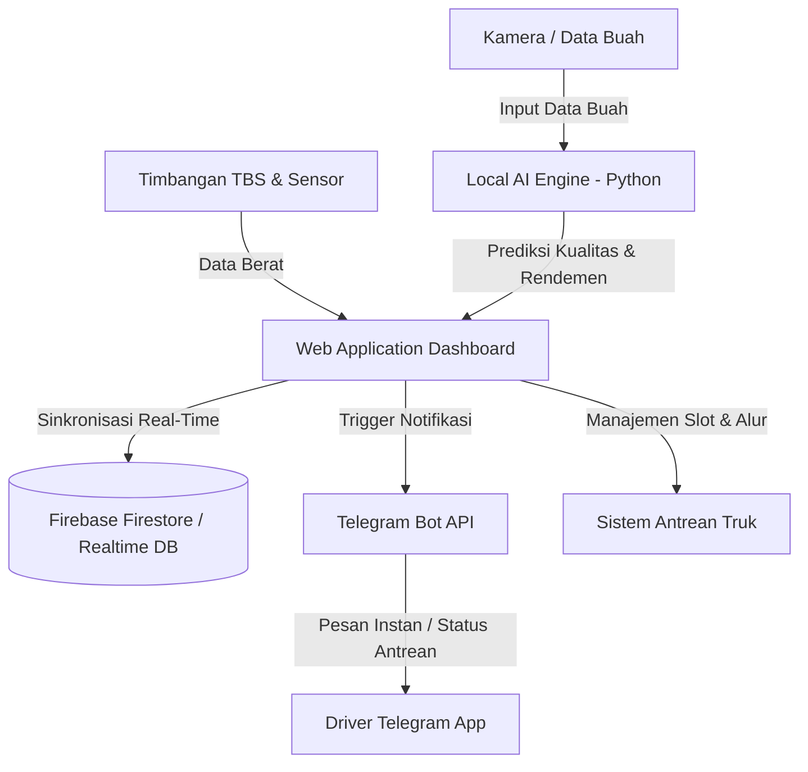

# Product Requirements Document (PRD)
## Smart Palm-Oil Yield & Sustainability Monitor

---

### 1. Visi Produk (Product Vision)
**Smart Palm-Oil Yield & Sustainability Monitor** adalah platform digital cerdas terintegrasi yang dirancang untuk merevolusi ekosistem pengelolaan dan pemantauan rantai pasok kelapa sawit (Tandan Buah Segar / TBS). Sistem ini bertujuan meningkatkan transparansi, mempercepat proses operasional pabrik kelapa sawit (PKS), serta meminimalkan jejak karbon dan waktu tunggu logistik. 

Dengan menggabungkan teknologi IoT/Firebase Real-Time, Kecerdasan Buatan lokal (Local AI), dan integrasi perpesanan instan Telegram, platform ini memastikan pencatatan hasil panen yang akurat, pemantauan kualitas rendemen yang otomatis, serta pengelolaan antrean truk logistik yang optimal.

---

### 2. Pilar Fokus & Efisiensi Implementasi
Proyek ini mengutamakan **efisiensi implementasi cerdas dan fungsionalitas teknis langsung di lapangan**. Kami menegaskan bahwa sistem ini:
* **Fokus pada metrik operasional riil** seperti kecepatan pemrosesan antrean, akurasi prediksi AI lokal terhadap rendemen aktual, dan stabilitas sinkronisasi Firebase.
* **Tidak menggunakan kuesioner evaluasi Usability Scale konvensional** (seperti *System Usability Scale* / SUS) untuk menguji antarmuka, melainkan mengandalkan validasi kegunaan langsung melalui efisiensi alur kerja pengemudi dan operator di lapangan (*field-driven usability verification*).

---

### 3. Fitur Utama (Core Features)

#### A. Pencatatan Timbangan TBS Real-Time via Firebase
* **Deskripsi**: Setiap truk pengangkut TBS yang masuk ke area timbangan pabrik akan ditimbang secara otomatis/manual. Data timbangan (berat kotor, potongan, berat bersih) langsung disinkronkan ke cloud database secara real-time.
* **Spesifikasi Teknis**:
  * Menggunakan database real-time (Firebase Realtime Database/Firestore) untuk pembaruan data instan di dasbor operator.
  * Dukungan pemantauan offline yang akan disinkronkan otomatis saat koneksi internet kembali stabil.

#### B. Prediksi Kualitas Rendemen Buah menggunakan Local AI Python
* **Deskripsi**: Analisis visual atau berbasis riwayat data buah kelapa sawit untuk memperkirakan persentase rendemen minyak sawit mentah (CPO) secara otomatis tanpa proses laboratorium yang lama.
* **Spesifikasi Teknis**:
  * Engine kecerdasan buatan berbasis Python yang berjalan secara lokal (Local AI) di server pabrik.
  * Memberikan hasil prediksi cepat saat truk melakukan registrasi muatan di gerbang depan.
  * Integrasi API lokal untuk menjembatani modul AI Python dengan antarmuka web.

#### C. Manajemen Antrean Truk Logistik
* **Deskripsi**: Mengatur antrean truk pengangkut kelapa sawit dari gerbang masuk, area timbangan, hingga area *loading dock* (ram) pembongkaran TBS.
* **Spesifikasi Teknis**:
  * Dasbor visual status antrean untuk operator PKS (antrean menunggu, ditimbang, membongkar muatan, selesai).
  * Algoritma prioritas antrean berbasis waktu kedatangan dan kualitas buah (jika diperlukan untuk mencegah degradasi asam lemak bebas/FFA).

#### D. Notifikasi Otomatis via Telegram untuk Driver
* **Deskripsi**: Komunikasi real-time dengan pengemudi truk tanpa mengharuskan mereka menginstal aplikasi khusus yang rumit.
* **Spesifikasi Teknis**:
  * Menggunakan Telegram Bot API.
  * Notifikasi otomatis dikirim saat:
    * Nomor antrean truk dipanggil untuk masuk.
    * Proses penimbangan berat kotor (gross) dan bersih (nett) selesai (dilengkapi rincian berat dan estimasi rendemen).
    * Instruksi pembongkaran di ram tertentu.

---

### 4. Arsitektur Tingkat Tinggi (High-Level Architecture)

---

### 5. Rencana Rilis & Validasi Operasional
* **Fase 1: Fondasi & Basis Data (Firebase & Antrean)**
  * Setup project Firebase dan pembuatan struktur database antrean serta penimbangan.
* **Fase 2: Otomatisasi Logistik & Bot Telegram**
  * Pembangunan Bot Telegram untuk driver serta logika pengiriman notifikasi antrean.
* **Fase 3: Local AI Model Integration**
  * Implementasi skrip Python lokal untuk prediksi kualitas rendemen dan integrasi endpoint API-nya ke web dashboard.
* **Fase 4: Pengujian Lapangan & Uji Coba Lapangan**
  * Validasi fungsional langsung oleh operator pabrik dan driver logistik untuk mengukur efisiensi sistem tanpa kuesioner formal.
